### Pregunta 1 — Catálogo comercial activo
El equipo de ventas prepara la tarifa de la próxima campaña y necesita el catálogo depurado.

**Enunciado**
Obtén los productos que **no** están descatalogados y cuyo precio unitario esté entre 10 y 50 euros, ambos incluidos. Muestra el nombre del producto y su precio redondeado a dos decimales, ordenado de mayor a menor precio.

**consulta**
```sql
Select product_id, unit_price
from products
where discontinued = 0 and 
unit_price between 10 and 50
order by unit_price DESC;
```


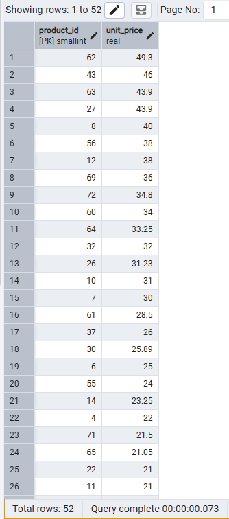

**comentario**
He utilizado where para filtrar primero por los prosuctos descatalogados y despues con el `between`filtro por los que estan en el rango que buscamos


Pregunta 2 — Concentración geográfica de la carteraEl equipo de ventas prepara la tarifa de la próxima campaña y necesita el catálogo depurado.

**Enunciado**
Dirección quiere saber en qué mercados está realmente concentrada la base de clientes antes de decidir dónde abrir delegación.

Cuenta cuántos clientes hay en cada país y muestra únicamente aquellos países con **5 o más clientes**, ordenados de mayor a menor. Indica también cuántas ciudades distintas hay en cada uno de esos países.

**consulta**
```sql
select country as pais ,
count(customer_id) as total_clientes,
COUNT(DISTINCT city) AS ciudades_distintas
from customers 
group by country
HAVING COUNT(customer_id) >= 5
ORDER BY 
    total_clientes DESC;
```


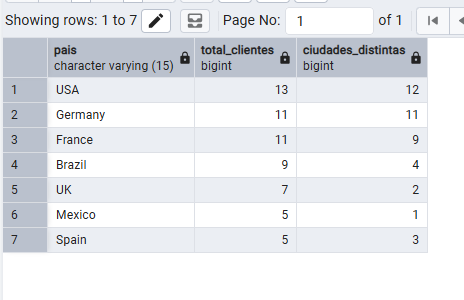

**comentario** con count(customer_id) cuento todos los clientes que existen despues con count(distinct city ) cuento cuantas ciudades diferentes tienen registros de un mismo cliente mediante group by country se realiza una agrupacion de los resultados para que las funcines de conteo sirvan para cada pais y mediante having count filtramos para mostar solo aquellos con 5 o mas 


### Pregunta 3 — Alerta de reposición

Logística necesita detectar qué referencias están en riesgo de rotura de stock

**Enunciado**
Localiza los productos activos cuyas unidades en stock sean inferiores o iguales a su nivel de reposición. Muestra el nombre, las unidades en stock, el nivel de reposición, las unidades ya pedidas al proveedor y una columna de texto que indique 'CRÍTICO' cuando el stock sea 0 y 'AVISO' en el resto de casos.

**consulta**
```sql
SELECT 
    product_name AS producto,
    units_in_stock AS stock,
    reorder_level AS nivel_reposicion,
    units_on_order AS pedido_a_proveedor,
    CASE 
		when units_in_stock = 0 THEN ' critico'
		ELSE 'AVISO'
	End as situacion
FROM Products
```


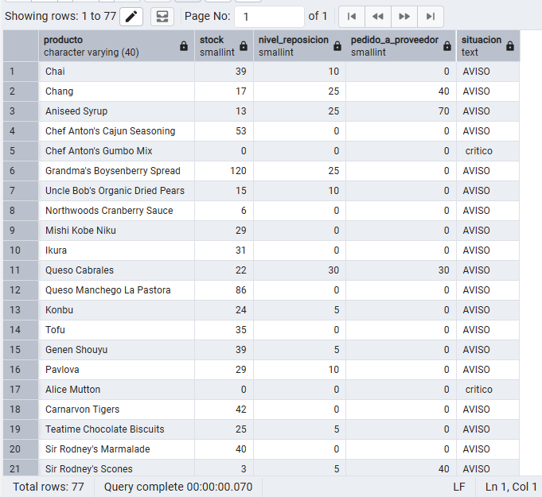

**comentario** utilizo case when porque como nos pide indicar si critico o aviso segun el stock disponible y con where filtramos por su disponivilidad buscando solo porductos activos 

### Pregunta 4 — Ficha completa de producto

Marketing va a rehacer el catálogo impreso y necesita cada producto con su categoría y los datos de contacto de quien lo suministra.

**Enunciado**
Para los productos suministrados por empresas de **Italia, Francia o España**, muestra el nombre del producto, el nombre de la categoría, el nombre del proveedor, su país y su ciudad. Ordena por país y, dentro de cada país, por nombre de producto.

**Columnas esperadas:** `producto`, `categoria`, `proveedor`, `pais`, `ciudad`

**Técnicas:** `INNER JOIN` de tres tablas, alias de tabla, `WHERE ... IN`

> **Pista:** `products` no se une directamente con nada geográfico. Mira el diagrama: la información de país está en `suppliers`.
>

**consulta**
```sql
SELECT p.product_name AS producto,
       c.category_name AS categoria,
       s.company_name AS proveedor,
       s.country AS pais,
       s.city AS ciudad
FROM products p
INNER JOIN categories c ON p.category_id = c.category_id
INNER JOIN suppliers s ON p.supplier_id = s.supplier_id
WHERE s.country IN ('Italy', 'France', 'Spain')
ORDER BY s.country ASC, p.product_name ASC;
```


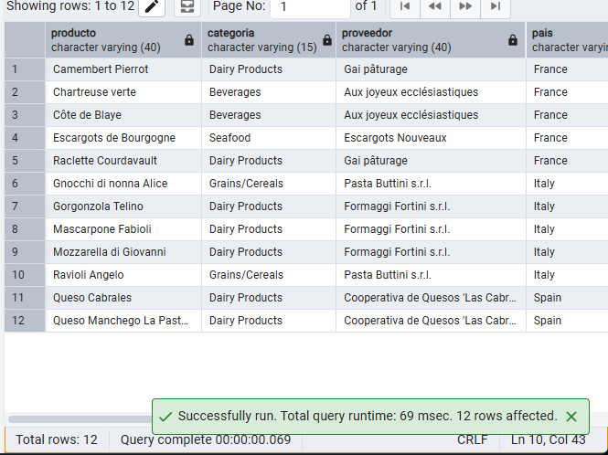

**comentario** 
 con un inner join se enlazan las tres tablas usando productos como la principal y usando un filtro sobre los paises

### Pregunta 5 — Detalle valorizado de un pedido

Atención al cliente recibe una reclamación sobre el pedido **10248** y necesita reconstruir la factura línea a línea.

**Enunciado**
Muestra, para ese pedido, el nombre del producto, el precio unitario aplicado, la cantidad, el descuento y el importe final de cada línea. Añade el nombre del cliente y la fecha del pedido.

**Columnas esperadas:** `cliente`, `fecha_pedido`, `producto`, `precio_unitario`, `cantidad`, `descuento`, `importe_linea`

**Técnicas:** `INNER JOIN` con `USING`, aritmética entre columnas, `ROUND()`

> **Pista:** `orders` y `order_details` comparten el nombre de columna `order_id`; `order_details` y `products` comparten `product_id`. Cuando los nombres coinciden a ambos lados, `USING(columna)` es más limpio que `ON a.col = b.col` y además evita que la columna aparezca duplicada en el resultado.
>

**consulta**
```sql
SELECT cli.company_name AS cliente,
       ord.order_date AS fecha_pedido,
       prod.product_name AS producto,
       ROUND(det.unit_price::numeric, 2) AS precio_unitario,
       det.quantity AS cantidad,
       det.discount AS descuento,
       ROUND((det.unit_price::numeric) * det.quantity * (1 - det.discount::numeric), 2) AS importe_linea
FROM orders ord
INNER JOIN customers cli ON ord.customer_id = cli.customer_id
INNER JOIN order_details det ON ord.order_id = det.order_id
INNER JOIN products prod ON det.product_id = prod.product_id
WHERE ord.order_id = 10248;
```


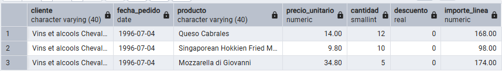

**comentario** 
En el round el resultado se le hace un cast para evitar los error al usar floats pasandolo a un typo `numeric` 

 ### Pregunta 6 — Ranking de categorías por facturación

Comité de dirección: ¿qué familias de producto sostienen realmente el negocio?

**Enunciado**

Calcula la facturación total de cada categoría durante toda la historia de la compañía. Muestra el nombre de la categoría, el número de líneas de pedido que ha generado, el número de productos distintos vendidos y la facturación total. Incluye únicamente las categorías que superen los **100.000 euros** de facturación, ordenadas de mayor a menor.

**Columnas esperadas:** `categoria`, `num_lineas`, `num_productos`, `facturacion`

**Técnicas:** `INNER JOIN` de tres tablas, `GROUP BY`, `SUM()`, `COUNT(DISTINCT ...)`, `HAVING`, `ROUND()`

> **Pista:** el `HAVING` se aplica sobre la expresión agregada completa, no sobre el alias. En PostgreSQL puedes repetir la expresión o envolver la consulta.
>
**consulta**
```sql
SELECT cat.category_name AS categoria,
       COUNT(det.order_id) AS num_lineas,
       COUNT(DISTINCT det.product_id) AS num_productos,
       ROUND(SUM((det.unit_price::numeric) * det.quantity * (1 - det.discount::numeric)), 2) AS facturacion
FROM categories cat
INNER JOIN products prod ON cat.category_id = prod.category_id
INNER JOIN order_details det ON prod.product_id = det.product_id
GROUP BY cat.category_name
HAVING SUM((det.unit_price::numeric) * det.quantity * (1 - det.discount::numeric)) > 100000
ORDER BY facturacion DESC;
```


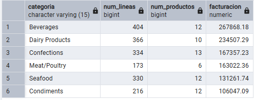

**comentario** 
he utilizado count junto con distint para contar solamente los articulos unicos y no contar todas las ventas, se realiza join de las tablas productos con categoria y con detalles del pedido agrupando todo por el nombre de la categoria para permitirnos filtras mediante el having


### Pregunta 7 — Clientes sin actividad comercial

Dirección comercial sospecha que hay cuentas abiertas que nunca han llegado a comprar.
**Enunciado**
Lista **todos** los clientes con el número de pedidos que ha realizado cada uno y la fecha de su último pedido. Los clientes sin ningún pedido deben aparecer igualmente, con un 0 en el conteo y el texto `'SIN PEDIDOS'` en lugar de la fecha. Ordena de forma que los clientes inactivos aparezcan primero.

**Columnas esperadas:** `cliente`, `pais`, `num_pedidos`, `ultimo_pedido`

**Técnicas:** `LEFT JOIN`, `COUNT()` sobre columna de la tabla derecha, `COALESCE()`, `MAX()`

> **Pista:** `COUNT(*)` cuenta filas, incluidas las que el `LEFT JOIN` rellenó con nulos, y te dará 1 para los clientes sin pedidos. `COUNT(columna)` ignora los nulos. Esa diferencia es exactamente el objetivo del ejercicio.
>

**consulta**
```sql
SELECT cli.company_name AS cliente,
       cli.country AS pais,COUNT(ord.order_id) AS num_pedidos,
       COALESCE(TO_CHAR(MAX(ord.order_date), 'YYYY-MM-DD'), 'SIN PEDIDOS') AS ultimo_pedido
FROM customers cli
LEFT JOIN orders ord ON cli.customer_id = ord.customer_id
GROUP BY cli.company_name, cli.country
ORDER BY num_pedidos ASC, cliente ASC;
```


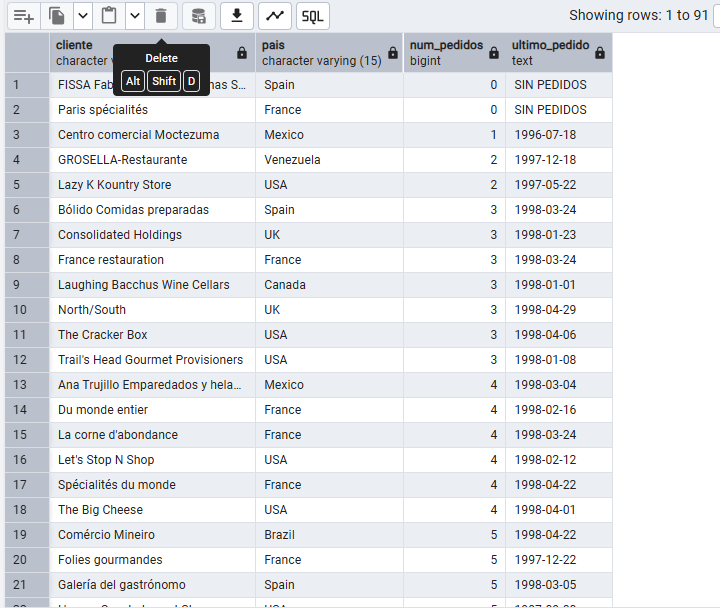

**comentario** 
En esta consulta utilizo left join para poder obtener el resultado de aquellas empresas que no han hecho transaciones y mediante el uso de COALESCE podemos añadir texto cunado no hay fecha 


### Pregunta 8 — Organigrama de la fuerza de ventas

Recursos Humanos necesita el organigrama del departamento comercial en formato tabla.
**Enunciado**

Muestra cada empleado con su nombre completo, su cargo, el nombre completo de la persona a la que reporta y el cargo de esa persona. El empleado que no reporta a nadie debe aparecer también, con el texto `'DIRECCIÓN GENERAL'` en el campo del responsable.

**Columnas esperadas:** `empleado`, `cargo`, `responsable`, `cargo_responsable`

**Técnicas:** `SELF JOIN` con `LEFT JOIN`, alias de tabla obligatorios, concatenación de texto, `COALESCE()`

> **Pista:** la misma tabla aparece dos veces en el `FROM`, así que los alias dejan de ser una comodidad y pasan a ser imprescindibles. Piensa en `emp` y `jefe` como si fueran dos tablas distintas.
>
**consulta**
```sql
SELECT (emp.first_name || ' ' || emp.last_name) AS empleado,
       emp.title AS cargo,
       COALESCE(jefe.first_name || ' ' || jefe.last_name, 'DIRECCIÓN GENERAL') AS responsable,
       COALESCE(jefe.title, 'DIRECCIÓN GENERAL') AS cargo_responsable
FROM employees emp
LEFT JOIN employees jefe ON emp.reports_to = jefe.employee_id
ORDER BY responsable ASC, empleado ASC;
```


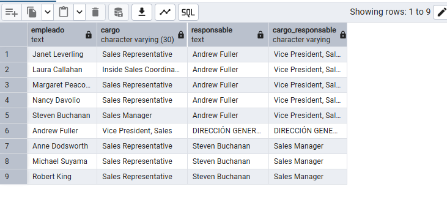

**comentario** 


### Pregunta 9 — Rejilla de cobertura categoría × año

Control de gestión quiere una rejilla completa de facturación por categoría y año, **sin huecos**: si una categoría no vendió nada en un año concreto, debe aparecer con un 0, no desaparecer de la tabla.

**Enunciado**

Genera todas las combinaciones posibles de las 8 categorías con los 3 años del histórico (24 filas) y asocia a cada combinación su facturación. Ordena por categoría y año.

**Columnas esperadas:** `categoria`, `anio`, `facturacion`

**Técnicas:** `CROSS JOIN` para generar la rejilla, `LEFT JOIN` contra los datos reales, `COALESCE()`, `EXTRACT()`

> **Pista:** este es el patrón clásico para informes con huecos. Primero construyes el "esqueleto" de todas las combinaciones posibles con un `CROSS JOIN`, y solo después cuelgas los datos reales con un `LEFT JOIN`. Si lo haces al revés, las combinaciones sin datos nunca aparecerán.
>
**consulta**
```sql
SELECT c.category_name AS categoria,
       periodos.anio,
       COALESCE(ROUND(SUM((det.unit_price::numeric) * det.quantity * (1 - det.discount::numeric)), 2), 0) AS facturacion
FROM categories c
CROSS JOIN (
    SELECT DISTINCT EXTRACT(YEAR FROM order_date)::int AS anio 
    FROM orders
) periodos
LEFT JOIN products p ON c.category_id = p.category_id
LEFT JOIN order_details det ON p.product_id = det.product_id
LEFT JOIN orders ord ON det.order_id = ord.order_id 
                     AND EXTRACT(YEAR FROM ord.order_date) = periodos.anio
GROUP BY c.category_name, periodos.anio
ORDER BY c.category_name ASC, periodos.anio ASC;
```


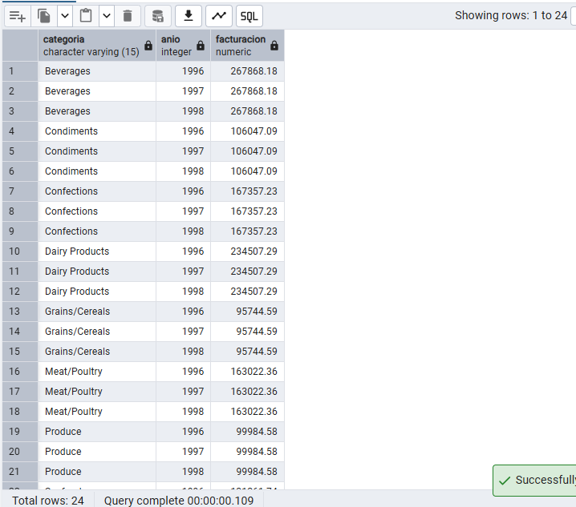

**comentario** 


 ### Pregunta 10 — Mapa de países: clientes frente a proveedores

Expansión internacional quiere una única tabla que muestre, para cada país en el que la compañía tiene presencia, cuántos clientes y cuántos proveedores hay. Deben aparecer los países que solo tienen clientes, los que solo tienen proveedores y los que tienen ambos.
**Enunciado**
**Columnas esperadas:** `pais`, `num_clientes`, `num_proveedores`, `tipo_presencia`

Donde `tipo_presencia` toma los valores `'SOLO CLIENTES'`, `'SOLO PROVEEDORES'` o `'AMBOS'`.

**Técnicas:** `FULL JOIN` entre dos subconsultas agregadas, `COALESCE()`, `CASE WHEN`

> **Pista:** en un `FULL JOIN` la columna de unión puede venir nula por cualquiera de los dos lados. Si escribes `SELECT a.country`, perderás el nombre de los países que solo existen en la tabla `b`.
>

**consulta**
```sql
SELECT COALESCE(cli.country, prov.country) AS pais,
       COALESCE(cli.num_clientes, 0) AS num_clientes,
       COALESCE(prov.num_proveedores, 0) AS num_proveedores,
       CASE 
           WHEN cli.country IS NOT NULL AND prov.country IS NOT NULL THEN 'AMBOS'
           WHEN cli.country IS NOT NULL THEN 'SOLO CLIENTES'
           ELSE 'SOLO PROVEEDORES'
       END AS tipo_presencia
FROM (
    SELECT country, COUNT(customer_id) AS num_clientes 
    FROM customers 
    GROUP BY country
) cli
FULL JOIN (
    SELECT country, COUNT(supplier_id) AS num_proveedores 
    FROM suppliers 
    GROUP BY country
) prov ON cli.country = prov.country
ORDER BY pais ASC;
```


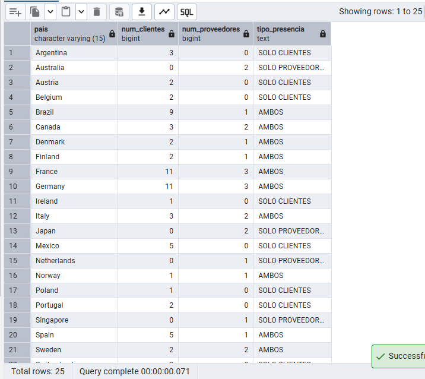

**comentario** 


### Pregunta 11 — Directorio unificado de contactos

Sistemas va a migrar el CRM y necesita una exportación única con todos los contactos de la compañía, vengan de donde vengan.
**Enunciado**

Construye una sola tabla que reúna los contactos de clientes, los de proveedores y los empleados. Cada fila debe indicar el origen (`'CLIENTE'`, `'PROVEEDOR'`, `'EMPLEADO'`), el nombre de la persona de contacto **en mayúsculas**, la organización a la que pertenece, la ciudad y el país. Para los empleados, la organización es el literal `'NORTHWIND TRADERS'` y el nombre de contacto se forma concatenando nombre y apellidos.

Ordena por origen y luego por país.

**Columnas esperadas:** `origen`, `contacto`, `organizacion`, `ciudad`, `pais`

**Técnicas:** `UNION ALL`, `UPPER()`, concatenación con `||` o `CONCAT()`, literales como columna

> **Pista:** las tres consultas deben devolver el mismo número de columnas, en el mismo orden y con tipos compatibles. Razona por qué aquí conviene `UNION ALL` y no `UNION`: ¿qué pasaría si un cliente y un proveedor compartieran nombre de contacto y ciudad?


**consulta**
```sql
SELECT 'CLIENTE' AS origen,
       UPPER(contact_name) AS contacto,
       company_name AS organizacion,
       city AS ciudad,
       country AS pais
FROM customers

UNION ALL

SELECT 'PROVEEDOR',
       UPPER(contact_name),
       company_name,
       city,
       country
FROM suppliers

UNION ALL

SELECT 'EMPLEADO',
       UPPER(first_name || ' ' || last_name),
       'NORTHWIND TRADERS',
       city,
       country
FROM employees
ORDER BY origen ASC, pais ASC;
```


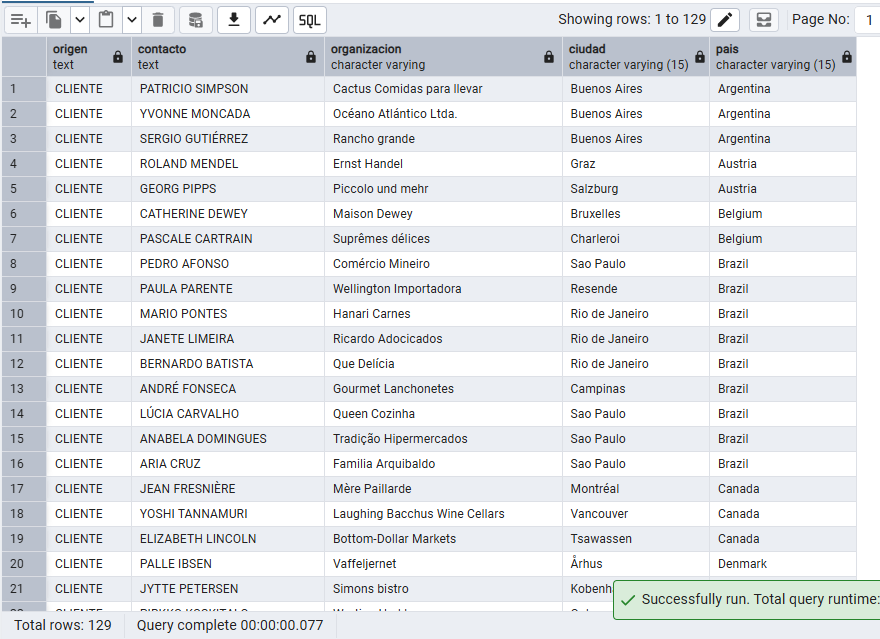

**comentario** 


### Pregunta 12 — Mercados con desequilibrio

Compras y Ventas mantienen una discusión recurrente: ¿en qué países vendemos sin tener proveedor local, y en cuáles coincidimos?

**Enunciado**
esuelve las dos preguntas en dos consultas independientes:

**a)** Países donde hay clientes pero **ningún** proveedor.
**b)** Países donde hay **a la vez** clientes y proveedores.

Ordena ambos resultados alfabéticamente.

**Columnas esperadas:** `pais`

**Técnicas:** `EXCEPT`, `INTERSECT`

> **Pista:** los operadores de conjunto eliminan duplicados automáticamente, a diferencia de `UNION ALL`. Compara el resultado del apartado (a) con el que obtendrías usando un `LEFT JOIN ... WHERE ... IS NULL`: llegan al mismo sitio por caminos distintos, y conviene que sepas escribir los dos.
>

**consulta**
```sql
SELECT country AS pais FROM customers
EXCEPT
SELECT country FROM suppliers
ORDER BY pais;

SELECT country AS pais FROM customers
INTERSECT
SELECT country FROM suppliers
ORDER BY pais;
```


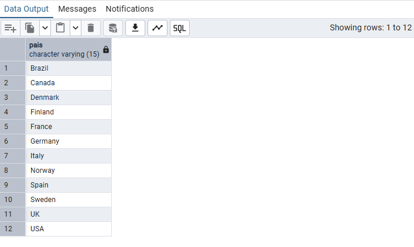

**comentario** 


### Pregunta 13 — Clientes que nunca han comprado pescado

El responsable de la categoría Seafood quiere una lista de cuentas sobre las que hacer campaña de captación.
**Enunciado**
Localiza los clientes que **nunca** han incluido un producto de la categoría `'Seafood'` en ninguno de sus pedidos. Muestra el nombre del cliente, su país y el número total de pedidos que sí ha realizado, de mayor a menor.

**Columnas esperadas:** `cliente`, `pais`, `pedidos_realizados`

**Técnicas:** anti join con `NOT EXISTS`, subconsulta correlacionada, `INNER JOIN` en la subconsulta

> **Pista:** hay tres formas de escribir un anti join: `NOT EXISTS`, `NOT IN` y `LEFT JOIN ... WHERE ... IS NULL`. Escribe la versión con `NOT EXISTS` y después prueba con `NOT IN`. Si la subconsulta de `NOT IN` puede devolver algún `NULL`, el resultado será una tabla vacía sin ningún mensaje de error. Es uno de los fallos más difíciles de detectar en SQL.
>

**consulta**
```sql
SELECT cli.company_name AS cliente,
       cli.country AS pais,
       COUNT(ord.order_id) AS pedidos_realizados
FROM customers cli
LEFT JOIN orders ord ON cli.customer_id = ord.customer_id
WHERE NOT EXISTS (
    SELECT 1
    FROM orders o_sub
    INNER JOIN order_details d_sub ON o_sub.order_id = d_sub.order_id
    INNER JOIN products p_sub ON d_sub.product_id = p_sub.product_id
    INNER JOIN categories c_sub ON p_sub.category_id = c_sub.category_id
    WHERE o_sub.customer_id = cli.customer_id
      AND c_sub.category_name = 'Seafood'
)
GROUP BY cli.company_name, cli.country
ORDER BY pedidos_realizados DESC;
```


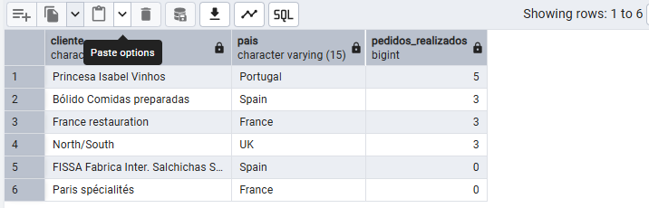

**comentario** 


### Pregunta 14 — Productos por encima de la media

El comité de precios quiere identificar el segmento premium del catálogo.

**Enunciado**
Muestra los productos activos cuyo precio unitario supere el precio medio de **todo** el catálogo. Incluye en cada fila el precio del producto, el precio medio general y la diferencia entre ambos, todo redondeado a dos decimales. Ordena por diferencia descendente.

**Columnas esperadas:** `producto`, `precio`, `precio_medio_catalogo`, `diferencia`

**Técnicas:** subconsulta escalar en `WHERE`, subconsulta escalar en `SELECT`, aritmética

> **Pista:** una subconsulta escalar es aquella que devuelve exactamente una fila y una columna, y por eso se puede usar donde iría un valor. Fíjate en que la misma subconsulta aparece en dos sitios; más adelante verás cómo evitar esa repetición con un CTE.
>

**consulta**
```sql
SELECT product_name AS producto,
       ROUND(unit_price::numeric, 2) AS precio,
       ROUND((SELECT AVG(unit_price::numeric) FROM products WHERE discontinued = 0), 2) AS precio_medio_catalogo,
       ROUND(unit_price::numeric - (SELECT AVG(unit_price::numeric) FROM products WHERE discontinued = 0), 2) AS diferencia
FROM products
WHERE discontinued = 0
  AND unit_price > (SELECT AVG(unit_price::numeric) FROM products WHERE discontinued = 0)
ORDER BY diferencia DESC;
```


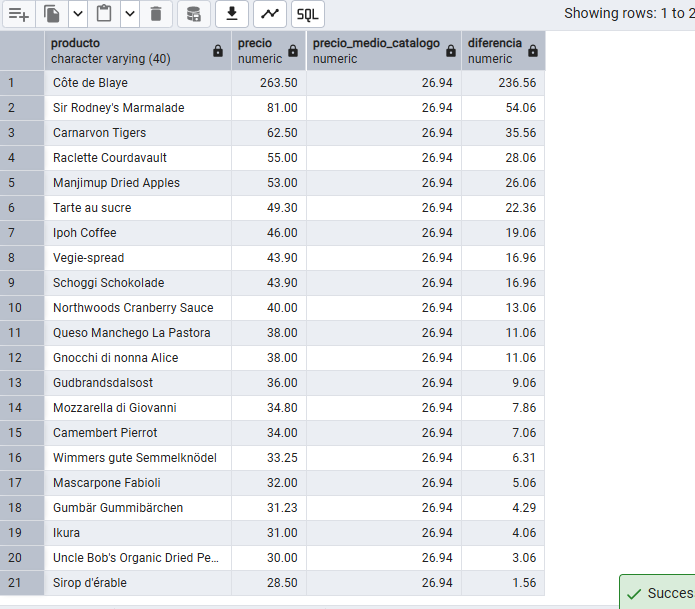

**comentario** 


### Pregunta 15 — Ticket medio por cliente

Dirección comercial quiere segmentar la cartera por valor medio de pedido, no por volumen total.

**Enunciado**

Calcula, para cada cliente que haya comprado alguna vez, el número de pedidos, el importe total acumulado y el importe medio por pedido. Muestra los 15 clientes con mayor ticket medio.

El cálculo tiene dos niveles: primero hay que obtener el importe de cada pedido sumando sus líneas, y solo después promediar esos importes por cliente. **Promediar directamente las líneas daría un resultado distinto y equivocado.**

**Columnas esperadas:** `cliente`, `pais`, `num_pedidos`, `importe_total`, `ticket_medio`

**Técnicas:** subconsulta en `FROM` (tabla derivada), agregación en dos niveles, `LIMIT`

> **Pista:** toda subconsulta en `FROM` necesita un alias en PostgreSQL, aunque no lo uses. Si lo olvidas, el error que verás es `subquery in FROM must have an alias`.
> 
**consulta**
```sql
SELECT cli.company_name AS cliente,
       cli.country AS pais,
       COUNT(totales.order_id) AS num_pedidos,
       ROUND(SUM(totales.importe_pedido), 2) AS importe_total,
       ROUND(AVG(totales.importe_pedido), 2) AS ticket_medio
FROM customers cli
INNER JOIN (
    SELECT o.order_id,
           o.customer_id,
           SUM((d.unit_price::numeric) * d.quantity * (1 - d.discount::numeric)) AS importe_pedido
    FROM order_details d
    INNER JOIN orders o ON d.order_id = o.order_id
    GROUP BY o.order_id, o.customer_id
) totales ON cli.customer_id = totales.customer_id
GROUP BY cli.company_name, cli.country
ORDER BY ticket_medio DESC
LIMIT 15;
```


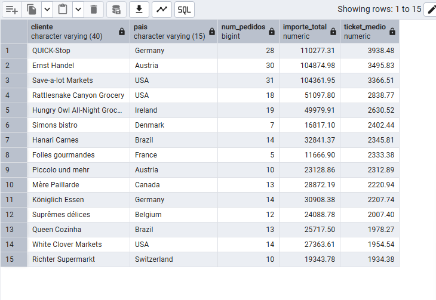

**comentario** 


### Pregunta 16 — El producto más caro de cada categoría

El equipo de compras quiere revisar el posicionamiento de precio en cada familia.

**Enunciado**
Para cada categoría, muestra el producto con el precio unitario más alto. Incluye el nombre de la categoría, el nombre del producto, su precio y el precio medio de su categoría.

Resuélvelo con una **subconsulta correlacionada**: para cada producto, comprueba si su precio coincide con el máximo de su propia categoría.

**Columnas esperadas:** `categoria`, `producto`, `precio`, `precio_medio_categoria`

**Técnicas:** subconsulta correlacionada en `WHERE`, subconsulta correlacionada en `SELECT`, `INNER JOIN`

> **Pista:** una subconsulta correlacionada se ejecuta conceptualmente una vez por cada fila de la consulta externa, porque hace referencia a una columna de esa fila. Eso la hace potente pero costosa. Cuando termines, plantéate cuál sería el coste sobre una tabla de diez millones de filas.
>

**consulta**
```sql
SELECT cat.category_name AS categoria,
       prod.product_name AS producto,
       ROUND(prod.unit_price::numeric, 2) AS precio,
       ROUND((
           SELECT AVG(p_avg.unit_price::numeric)
           FROM products p_avg
           WHERE p_avg.category_id = prod.category_id
       ), 2) AS precio_medio_categoria
FROM products prod
INNER JOIN categories cat ON prod.category_id = cat.category_id
WHERE prod.unit_price = (
    SELECT MAX(p_top.unit_price)
    FROM products p_top
    WHERE p_top.category_id = prod.category_id
)
ORDER BY cat.category_name ASC;
```


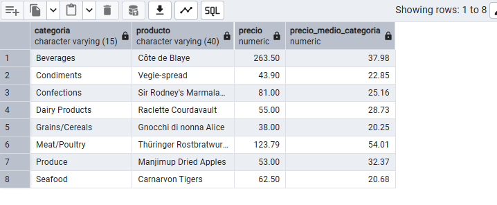

**comentario** 


### Pregunta 17 — Segmentación ABC de la cartera de clientes

Dirección quiere clasificar a los clientes en tres tramos de valor para asignar recursos comerciales.
**Enunciado**

Usando expresiones de tabla común (CTE), construye una consulta que:

1. Calcule la facturación total de cada cliente.
2. Divida los clientes en **cuartiles** según esa facturación.
3. Asigne una etiqueta de segmento: `'A - Estratégico'` al cuartil superior, `'B - Consolidado'` al segundo, `'C - Ocasional'` al tercero y `'D - Marginal'` al cuarto.
4. Devuelva, por segmento, el número de clientes, la facturación total del segmento y el porcentaje que representa sobre el total de la compañía.

**Columnas esperadas:** `segmento`, `num_clientes`, `facturacion_segmento`, `porcentaje_sobre_total`

**Técnicas:** `WITH` con varias CTE encadenadas, `NTILE()`, `CASE WHEN`, agregación sobre el resultado de una CTE, cálculo de porcentaje

> **Pista:** encadenar CTE permite leer la consulta de arriba abajo como una receta, en lugar de descifrarla de dentro hacia fuera como ocurre con las subconsultas anidadas. Una CTE puede referirse a las declaradas antes que ella.
>
**consulta**
```sql
WITH ventas_por_cliente AS (
    SELECT ord.customer_id,
           SUM((det.unit_price::numeric) * det.quantity * (1 - det.discount::numeric)) AS facturacion
    FROM orders ord
    INNER JOIN order_details det ON ord.order_id = det.order_id
    GROUP BY ord.customer_id
),
segmentos AS (
    SELECT customer_id,
           facturacion,
           NTILE(4) OVER (ORDER BY facturacion DESC) AS cuartil
    FROM ventas_por_cliente
),
etiquetas_finales AS (
    SELECT customer_id,
           facturacion,
           CASE cuartil
               WHEN 1 THEN 'A - Estratégico'
               WHEN 2 THEN 'B - Consolidado'
               WHEN 3 THEN 'C - Ocasional'
               WHEN 4 THEN 'D - Marginal'
           END AS segmento
    FROM segmentos
)
SELECT segmento,
       COUNT(customer_id) AS num_clientes,
       ROUND(SUM(facturacion), 2) AS facturacion_segmento,
       ROUND((SUM(facturacion) / (SELECT SUM(facturacion) FROM ventas_por_cliente) * 100), 2) AS porcentaje_sobre_total
FROM etiquetas_finales
GROUP BY segmento
ORDER BY facturacion_segmento DESC;
```


**comentario** 


### Pregunta 18 — Los tres productos más vendidos de cada categoría

El equipo de categoría necesita el podio de cada familia para negociar con proveedores.
**Enunciado**

Para cada categoría, obtén los **tres productos con mayor facturación**. Muestra la categoría, la posición dentro de la categoría, el nombre del producto, las unidades vendidas y la facturación.

Incluye además una columna con la posición global del producto en el conjunto de la compañía, para que se vea qué productos son líderes de su nicho pero irrelevantes en el total.

**Columnas esperadas:** `categoria`, `posicion_en_categoria`, `producto`, `unidades`, `facturacion`, `posicion_global`

**Técnicas:** `RANK()` o `ROW_NUMBER()` con `OVER (PARTITION BY ... ORDER BY ...)`, CTE para poder filtrar por la posición, función de ventana sin `PARTITION BY`

> **Pista:** no se puede filtrar por una función de ventana en el `WHERE`, porque las funciones de ventana se evalúan después del filtrado. Necesitas calcularla en una CTE o subconsulta y filtrar fuera.
> 
> 
> Piensa también qué ocurriría con `RANK()` frente a `DENSE_RANK()` frente a `ROW_NUMBER()` si dos productos empatasen exactamente en facturación.


**consulta**
```sql
WITH resumen_productos AS (
    SELECT p.category_id,
           p.product_id,
           p.product_name AS producto,
           SUM(det.quantity) AS unidades,
           ROUND(SUM((det.unit_price::numeric) * det.quantity * (1 - det.discount::numeric)), 2) AS facturacion
    FROM products p
    INNER JOIN order_details det ON p.product_id = det.product_id
    GROUP BY p.category_id, p.product_id, p.product_name
),
posicionamiento AS (
    SELECT rp.*,
           DENSE_RANK() OVER (PARTITION BY rp.category_id ORDER BY rp.facturacion DESC) AS posicion_en_categoria,
           DENSE_RANK() OVER (ORDER BY rp.facturacion DESC) AS posicion_global
    FROM resumen_productos rp
)
SELECT cat.category_name AS categoria,
       pos.posicion_en_categoria,
       pos.producto,
       pos.unidades,
       pos.facturacion,
       pos.posicion_global
FROM posicionamiento pos
INNER JOIN categories cat ON pos.category_id = cat.category_id
WHERE pos.posicion_en_categoria <= 3
ORDER BY cat.category_name ASC, pos.posicion_en_categoria ASC;
```


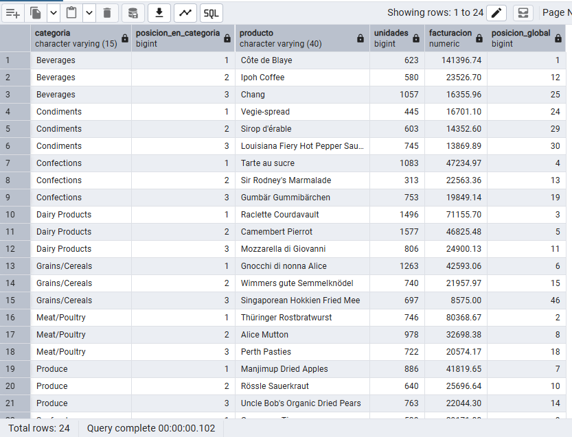

**comentario** 


### Pregunta 19 — Evolución mensual con acumulado y media móvil

Control de gestión prepara el cuadro de mando de la evolución del negocio durante 1997.

**Enunciado**

Para cada mes de 1997, calcula:

- La facturación del mes.
- El total acumulado desde enero.
- La media móvil de los tres últimos meses (el mes actual y los dos anteriores).
- La facturación del mes anterior.
- La variación porcentual respecto al mes anterior.

**Columnas esperadas:** `mes`, `facturacion`, `acumulado`, `media_movil_3m`, `mes_anterior`, `variacion_pct`

**Técnicas:** `DATE_TRUNC()`, `SUM() OVER (ORDER BY ...)` como total acumulado, definición explícita de marco con `ROWS BETWEEN 2 PRECEDING AND CURRENT ROW`, `LAG()`, CTE

> **Pista:** cuando una función de ventana agregada lleva `ORDER BY` pero no especificas marco, PostgreSQL aplica por defecto `RANGE BETWEEN UNBOUNDED PRECEDING AND CURRENT ROW`, que es justo lo que quieres para el acumulado. Para la media móvil ese comportamiento por defecto no sirve: ahí tienes que declarar el marco tú.
> 
> 
> La primera fila no tiene mes anterior. Decide qué mostrar en ese caso.
>
**consulta**
```sql
WITH mensuales_1997 AS (
    SELECT DATE_TRUNC('month', ord.order_date)::date AS mes,
           ROUND(SUM((det.unit_price::numeric) * det.quantity * (1 - det.discount::numeric)), 2) AS facturacion
    FROM orders ord
    INNER JOIN order_details det ON ord.order_id = det.order_id
    WHERE ord.order_date >= '1997-01-01' AND ord.order_date < '1998-01-01'
    GROUP BY DATE_TRUNC('month', ord.order_date)::date
)
SELECT mes,
       facturacion,
       SUM(facturacion) OVER (ORDER BY mes) AS acumulado,
       ROUND(AVG(facturacion) OVER (
           ORDER BY mes 
           ROWS BETWEEN 2 PRECEDING AND CURRENT ROW
       ), 2) AS media_movil_3m,
       LAG(facturacion) OVER (ORDER BY mes) AS mes_anterior,
       ROUND(((facturacion - LAG(facturacion) OVER (ORDER BY mes)) / LAG(facturacion) OVER (ORDER BY mes) * 100), 2) AS variacion_pct
FROM mensuales_1997
ORDER BY mes ASC;
```


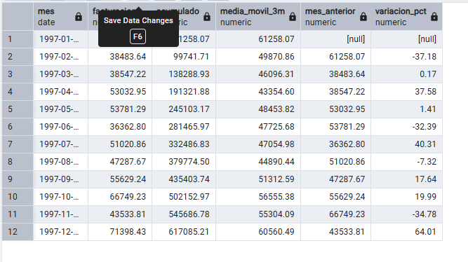

**comentario** 


### Pregunta 20 — Cuadro de mando anual por categoría

Última petición, y la más ambiciosa: el informe anual que se presenta al consejo.
**Enunciado**
Construye una tabla donde cada fila sea una categoría y las columnas muestren la facturación de 1996, 1997 y 1998 en columnas separadas, más el total de los tres años. Añade al final una fila de totales generales.

Incluye además una columna que indique el peso de cada categoría sobre la facturación total de la compañía, y otra que muestre si la categoría creció o decreció entre 1997 y 1998.

**Columnas esperadas:** `categoria`, `f_1996`, `f_1997`, `f_1998`, `total`, `peso_pct`, `tendencia`

**Técnicas:** pivotado manual con `CASE WHEN` dentro de `SUM()` (o `FILTER`), `ROLLUP` para la fila de totales, `COALESCE()`, `CASE WHEN` para la tendencia, funciones de ventana para el peso

> **Pista:** el pivotado en SQL estándar consiste en convertir filas en columnas mediante una función de agregación que solo suma cuando se cumple una condición. PostgreSQL ofrece dos sintaxis equivalentes: `SUM(CASE WHEN anio = 1997 THEN importe ELSE 0 END)` y la más moderna `SUM(importe) FILTER (WHERE anio = 1997)`. Escribe la versión con `FILTER`, que es específica de PostgreSQL y mucho más legible.
> 
> 
> Ten en cuenta que 1996 solo tiene medio año de datos (desde julio) y 1998 llega solo hasta mayo. La tendencia entre 1997 y 1998 no es comparable sin normalizar. Menciónalo en un comentario dentro de tu consulta: detectar que una comparación no es válida vale más que calcularla bien.


**consulta**
```sql

WITH cuadro_anual AS (
    SELECT cat.category_name,
           ROUND(SUM((det.unit_price::numeric) * det.quantity * (1 - det.discount::numeric)) 
                 FILTER (WHERE EXTRACT(YEAR FROM ord.order_date) = 1996), 2) AS f_1996,
           ROUND(SUM((det.unit_price::numeric) * det.quantity * (1 - det.discount::numeric)) 
                 FILTER (WHERE EXTRACT(YEAR FROM ord.order_date) = 1997), 2) AS f_1997,
           ROUND(SUM((det.unit_price::numeric) * det.quantity * (1 - det.discount::numeric)) 
                 FILTER (WHERE EXTRACT(YEAR FROM ord.order_date) = 1998), 2) AS f_1998,
           ROUND(SUM((det.unit_price::numeric) * det.quantity * (1 - det.discount::numeric)), 2) AS total
    FROM categories cat
    INNER JOIN products prod ON cat.category_id = prod.category_id
    INNER JOIN order_details det ON prod.product_id = det.product_id
    INNER JOIN orders ord ON det.order_id = ord.order_id
    GROUP BY ROLLUP(cat.category_name)
)
SELECT COALESCE(category_name, 'TOTAL GENERAL') AS categoria,
       COALESCE(f_1996, 0) AS f_1996,
       COALESCE(f_1997, 0) AS f_1997,
       COALESCE(f_1998, 0) AS f_1998,
       total,
       ROUND((total / (SELECT total FROM cuadro_anual WHERE category_name IS NULL) * 100), 2) AS peso_pct,
       CASE 
           WHEN category_name IS NULL THEN 'N/A'
           WHEN f_1998 > f_1997 THEN 'CRECE'
           ELSE 'DECRECE'
       END AS tendencia
FROM cuadro_anual
ORDER BY (category_name IS NULL) ASC, total DESC;
```


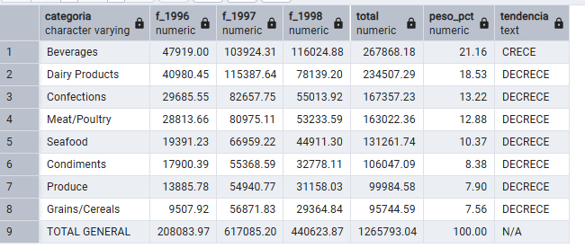

**comentario** 
